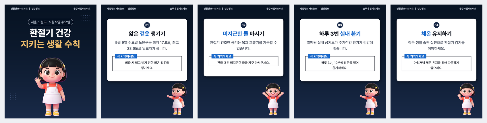
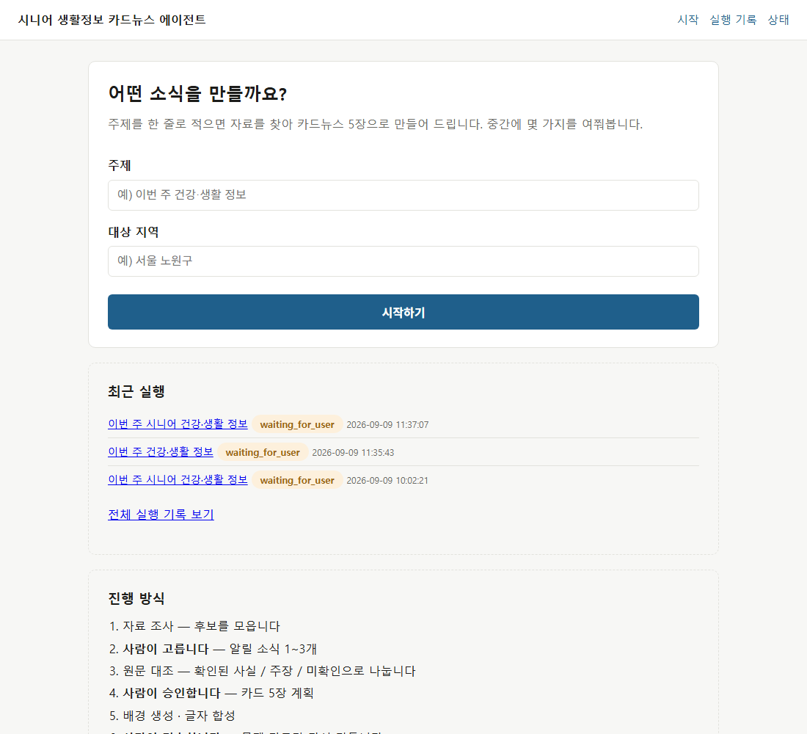
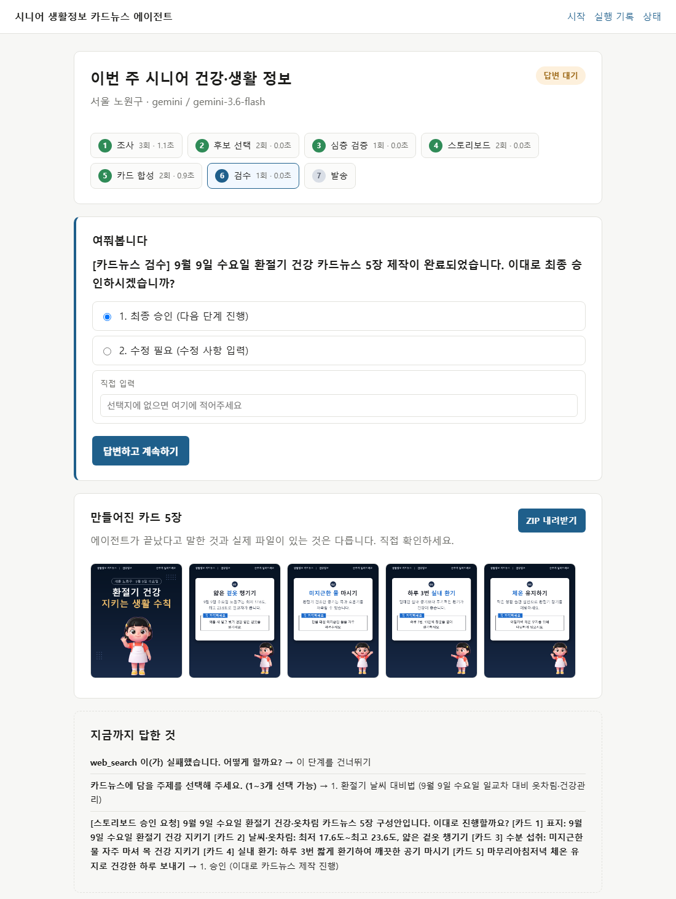
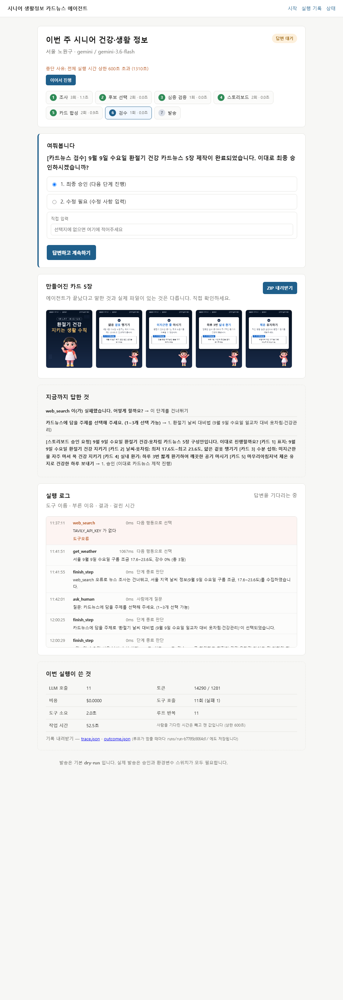
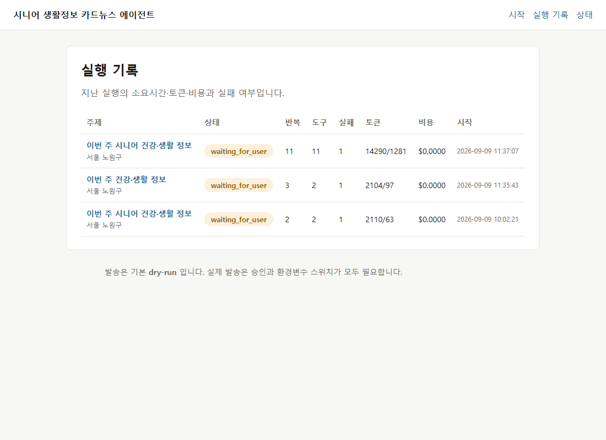

# 시니어 생활정보 카드뉴스 에이전트

주제를 한 줄 넣으면 자료를 조사하고, **중간중간 사람에게 물어보며** 진행해
시니어용 카드뉴스 5장(PNG 1080×1350)을 만들어 주는 웹 서비스.

> 카드뉴스를 만드는 게 아니라, **카드뉴스를 만들어주는 서비스**를 만든 것이다.



---

## 무엇을 해결하나

경로당·복지관·시니어 채널에 주기적으로 생활정보 안내물을 올리는 일은 매번 이렇게 반복된다.

1. 알릴 만한 소식을 여기저기서 찾는다
2. 시니어가 이해할 수 있는 말로 다시 쓴다
3. 큰 글씨로 이미지를 만든다
4. 발송한다

찾는 데 오래 걸리고, 품질이 들쭉날쭉하고, 출처를 남기지 않아 나중에 확인이 안 된다.
이 에이전트는 **"주제 한 줄" → "바로 배포할 수 있는 카드뉴스 묶음"** 까지 끌고 간다.
사람은 **고르고 승인만** 한다.

자세한 기획은 [`PRD.md`](PRD.md), 왜 그렇게 정했는지는 [`DECISIONS.md`](DECISIONS.md)에 있다.

---

## 실행 방법

### 준비물

| 항목 | 필수 | 비고 |
|---|---|---|
| Python 3.12+ | ✅ | `uv` 로 자동 설치됨 |
| `GEMINI_API_KEY` | ✅ | [Google AI Studio](https://aistudio.google.com/apikey) 무료 |
| `TAVILY_API_KEY` | 선택 | 없으면 웹 검색이 빠지고 날씨로 진행 |
| `OPENAI_API_KEY` | 선택 | 모델 비교용 |

### 설치와 실행

```bash
git clone https://github.com/nike1137-svg/senior-cardnews-agent
cd senior-cardnews-agent
cp .env.example .env          # 키를 채운다. 환경변수가 이미 있으면 비워둬도 된다
uv sync
uv run uvicorn app.main:app --port 8765
```

브라우저에서 <http://localhost:8765> 를 연다.
`/healthz` 는 서버가 떴는지만이 아니라 **DB 테이블까지** 확인한다.

### 자체 MCP 서버 따로 띄우기

```bash
uv run python -m mcp_server.server
```

다른 MCP 클라이언트에서 쓰는 법은 [`mcp_server/README.md`](mcp_server/README.md) 참고.

---

## 화면

### 1. 시작 — 주제 입력



### 2. 진행 — 질문 카드 + 실행 로그

에이전트가 판단이 필요할 때 **멈추고 물어본다.** 답하면 그 자리에서 이어간다.
오른쪽 아래 실행 로그에는 **도구 이름 · 부른 이유 · 결과 · 걸린 시간**이 실시간으로 흐른다.



### 3. 전체 흐름 — 결과물 확인까지

단계 진행바 · 질문 · 만들어진 카드 · 답변 이력 · 실행 로그 · 토큰과 비용이 한 화면에 있다.



### 4. 실행 기록 — 비용 대시보드



---

## 어떻게 동작하나

### 에이전트 루프

정해진 순서대로 흐르는 파이프라인이 아니다. **매 반복마다 모델이 관찰 결과를 보고
다음 행동 하나를 고른다.**

```
목표 → 계획 → 도구 호출 → 결과 관찰 → 다음 행동 결정 → 반복
                                    ├ 도구를 더 부른다
                                    ├ ask_human 으로 사람에게 묻는다
                                    └ finish_step 으로 단계를 끝낸다
```

실제로 일어난 일 (검색 키가 없던 실행):

```
web_search 실패 → 사람에게 "어떻게 할까요?" → 건너뛰기 선택
→ get_weather 로 방향 전환 → 날씨 기반 주제 후보 3개 제시
→ 사람이 선택 → 원문 검증 → 스토리보드 승인 → 카드 5장 합성 → 검수 요청
```

### 종료 조건

무한 루프를 네 가지로 막는다.

| 항목 | 상한 |
|---|---|
| 단계별 재시도 | 3회 |
| 전체 반복 | 20회 |
| **에이전트 작업 시간** | 600초 — **사람을 기다린 시간은 빼고 잰다** |
| 비용·호출 | 어댑터가 유일한 관문이라 여기서 막는다 |

### 사람 개입 지점 4곳

소식 선택 · 스토리보드 승인 · 카드 검수 · **발송 승인**

- 질문 상태에서 새로고침해도 같은 질문이 남는다
- 같은 답을 두 번 보내도 **한 번만** 실행된다 (`UNIQUE (run_id, question_id, version)`)
- 지난 질문에 뒤늦게 답하면 안내만 하고 새 작업을 시작하지 않는다
- 서버가 재시작돼도 상태가 SQLite 에 남아 **중단 지점부터 이어간다**

---

## 도구 9개

각 도구는 **입출력 스키마 · description · 실패 처리 규칙 · 권한**을 함께 정의한다.

| 도구 | 하는 일 | 권한 | 실패하면 |
|---|---|---|---|
| `web_search` | 최근 소식 조사 (Tavily) | 읽기 | 0건이면 **사람에게 질문** |
| `fetch_article` | 원문을 열어 날짜·수치 대조 | 읽기 | **'미확인'으로 두고 계속** |
| `get_weather` | 지역 날씨 (Open-Meteo) | 읽기 | 건너뛰고 진행 |
| `compose_cards` | 카드 이미지 합성 (Pillow) | `output/<실행ID>/` 안만 | 1회 재시도 |
| `send_line` | LINE 발송 | 외부 발송 | 🔴 **재시도 금지** |
| `list_past_publications` | 과거 발행 이력 | 읽기 (MCP) | 건너뛰기 |
| `get_audience_profile` | 시니어 글쓰기 규칙 | 읽기 (MCP) | 건너뛰기 |
| `get_card_template` | 카드 양식 | 읽기 (MCP) | 건너뛰기 |
| `record_publication` | 발행 결과 기록 | 쓰기 (MCP) | 건너뛰기 |

### 🔴 LINE 발송은 3중 잠금

기본값이 `dry-run` 이다. 실제로 나가려면 **① 사람 승인 ② 환경변수 스위치 ③ 채널 토큰**
셋이 모두 있어야 한다. 채점자가 버튼을 눌러도 시니어에게 가지 않는다.
**실패해도 자동 재시도하지 않는다** — 중복 발송 위험이 있어 일부러 뺐다.

---

## 관찰 가능성

### 실행 로그

모든 도구 호출이 `run_tool()` 한 곳을 거치므로 빠짐없이 기록된다.
화면 로그 패널과 `trace.json` 이 전부 이 기록에서 나온다.

### trace.json / outcome.json

루프가 멈출 때마다 `runs/<실행ID>/` 에 자동 저장된다.

```jsonc
// outcome.json
{
  "completed": false,
  "steps_done": "5/7",
  "human_interventions": 3,
  "cards_made": true,
  "tool_calls": 11,
  "tool_failures": 1,
  "failure_labels": { "도구오류": 1 },
  "prompt_tokens": 14290,
  "bottleneck_step": { "step_no": 5, "name": "카드 합성", "seconds": 0.9 }
}
```

**어느 단계가 병목인지**를 단계별로 계산해 넣는다.

### 실패를 일부러 만들 수 있다

실패·재시도 화면은 실제 실패가 마침 그때 일어나야 볼 수 있고,
코드에 적어만 두고 한 번도 안 돌려본 대체 경로는 실제로는 안 돌아간다.

```bash
FAULT_INJECT=search_empty,image_fail uv run uvicorn app.main:app --port 8765
```

켜져 있으면 화면 상단에 그대로 표시한다. 숨기지 않는다.

---

## 카드 품질

**프로처럼 보이는 건 그림이 아니라 프레임이다.** 5장이 같은 배경·상단바·여백을 쓴다.

- 색은 셋뿐 — 남색 배경 + 흰 종이 + 강조 파랑. 표지만 골드 추가
- 배경 남색은 **캐릭터 이미지에서 뽑아온 값**이다. 맞춘 게 아니라 가져왔다
- 캐릭터는 한 장에 세 자세를 그린 **캐릭터 시트**를 코드로 잘라 쓴다.
  자세마다 따로 생성하면 얼굴이 달라져 "다른 아이"로 보인다
- 캐릭터가 가리키는 방향으로 시선이 간다. **항상 글이 있는 안쪽**을 향한다

### 검사를 코드가 한다

시니어 대상이라 "흐린 색 조합"을 사람 판단에 맡기지 않는다.

- 글자 크기 하한 (본문 38px)
- 배경 대비 **명암비 4.5:1** (WCAG AA)
- 360px 축소본으로 모바일 가독성 확인

실제로 이 검사가 **강조 파랑이 4.11:1 로 미달**인 것을 잡아냈다. 눈으로는 몰랐다.

---

## 안전

- API 키는 전부 환경변수. `.env` 는 커밋하지 않는다
- 프롬프트로 나가는 모든 문자열에서 **키 형태 문자열을 걸러낸다** (`app/llm/redact.py`)
- 파일 쓰기는 `output/<실행ID>/` 안으로만 제한한다.
  저장 폴더는 **앱이 정한다** — 모델에게 맡기면 지어낸 이름으로 새 폴더를 만든다
- 읽기 도구와 쓰기 도구를 분리한다

---

## 폴더 구조

```
app/
  agent/     루프 · 상태 저장 · 배경 실행 · trace 내보내기
  cards/     디자인 시스템 · 렌더 · 배경 제거 · 검사
  llm/       어댑터 · 단가표 · 상한 · 키 필터
  tools/     도구 5종 + MCP 연결 + 실패 주입 + 국내 좌표표
  routes/    화면 · 동작 · SSE
mcp_server/  자체 MCP 서버 (운영 데이터를 도구로 노출)
assets/      캐릭터 자산 4자세
docs/        캡처
runs/        trace.json · outcome.json  (git 제외)
output/      만들어진 카드          (git 제외)
```

---

## 알려진 제약

| 항목 | 내용 |
|---|---|
| **Gemini 무료 한도** | **모델당 하루 20회.** 한 모델이 막히면 다음 모델로 갈아탄다 (D-016) |
| **Gemini 이미지 API** | 무료 한도가 **0**. 이미지 생성은 Antigravity CLI 로만 한다 (D-014) |
| **Open-Meteo 지오코딩** | 한국 지명에 틀린 답을 준다(성남→황해남도). 내장 좌표표를 쓴다 |
| **LINE 실채널** | 미연동. dry-run 으로만 검증했다 |
