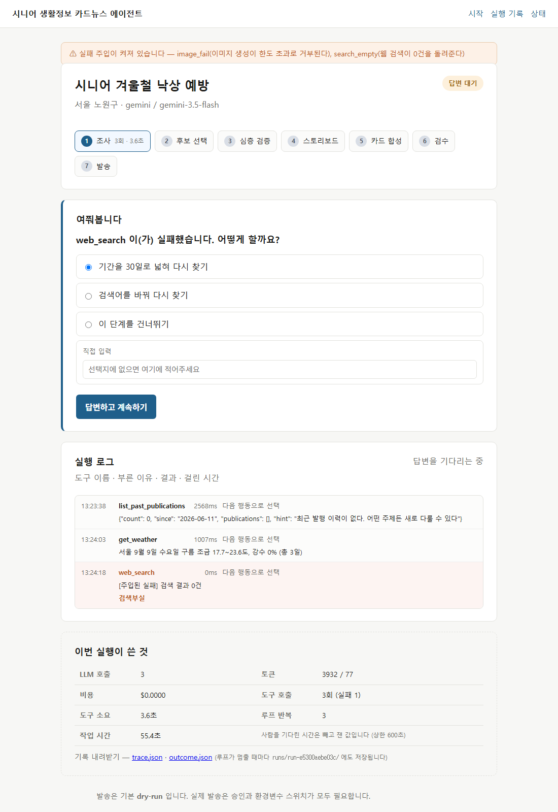
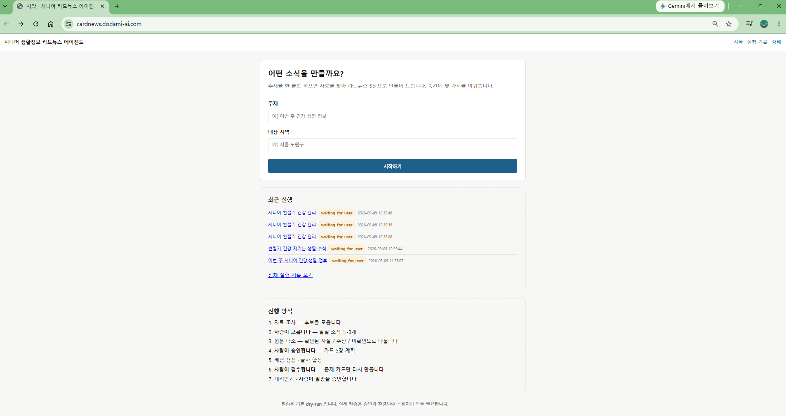

# 시니어 생활정보 카드뉴스 에이전트

주제를 한 줄 넣으면 자료를 조사하고, 중간중간 사람에게 물어보며 진행해
시니어용 카드뉴스 5장을 만들어 주는 웹 서비스입니다.
메인퀘스트4(내 도메인에서 쓸 에이전틱 워크플로로 서비스 만들기) 과제로 만들었습니다.

- 배포 주소: https://cardnews.dodami-ai.com
- 관련 문서: [PRD.md](./PRD.md) · [DECISIONS.md](./DECISIONS.md) · [EVAL.md](./EVAL.md)

> **접속 안내**: 위 주소는 제 노트북에서 도는 서버를 Cloudflare Tunnel로 연결한 것이라
> 노트북이 켜져 있는 동안에만 열립니다. 닫혀 있어도 아래 캡처와 `EVAL.md`의 실행 기록으로
> 실제 동작을 확인하실 수 있습니다.


## 서비스 소개

경로당이나 복지관에서 시니어에게 생활정보를 안내할 때는 매번 같은 일을 반복합니다.
알릴 만한 소식을 찾고, 시니어가 이해할 수 있는 말로 다시 쓰고, 큰 글씨로 이미지를 만들고,
발송합니다. 찾는 데 오래 걸리고 품질이 들쭉날쭉하며, 출처를 남기지 않아 나중에 확인이 안 됩니다.

이 에이전트는 "주제 한 줄"에서 "바로 배포할 수 있는 카드뉴스 묶음"까지 끌고 갑니다.
사람은 고르고 승인만 합니다.

만드는 것은 카드뉴스가 아니라 **카드뉴스를 만들어 주는 서비스**입니다.
그래서 카드가 예쁘게 나오는 것보다, 에이전트가 판단을 어떻게 했고 어디서 멈췄는지가
화면에 남는 것을 더 중요하게 봤습니다.

## 실제 실행 예시

아래는 2026년 9월 9일에 실제로 돌려 기록한 결과입니다. 손으로 만든 예시가 아닙니다.
`runs/<실행ID>/trace.json`에 같은 내용이 그대로 남아 있습니다.

### 검색 도구가 실패한 실행


Tavily 키가 없는 상태에서 실행했습니다. 에이전트는 이렇게 움직였습니다.

```
web_search 실패 → "어떻게 할까요?" 하고 사람에게 물음 → 사람이 "건너뛰기" 선택
→ get_weather로 방향을 틀어 날씨를 확보 → 그 날씨로 주제 후보 3개를 만들어 제시
→ 사람이 선택 → 원문 검증 → 스토리보드 승인 → 카드 5장 합성 → 검수 요청
```

도구 하나가 막혔을 때 멈추지 않고 다른 재료로 계속 간 것이 이 실행의 핵심입니다.
실패를 감추지 않고 화면 로그에 빨간 줄로 남겼습니다.

**이 실행이 쓴 것** — LLM 11회 호출, 입력 14,290 토큰 / 출력 1,281 토큰,
도구 11회(실패 1회), 에이전트 작업 시간 52.5초.

### 전체 흐름


한 화면에 단계 진행바, 질문 카드, 만들어진 카드 5장, 지금까지 답한 내용,
실행 로그, 토큰과 비용이 함께 있습니다. 이 화면 하나로 "무엇을 왜 했고 얼마나 들었는지"를
다 볼 수 있게 하려고 나누지 않고 한 페이지에 넣었습니다.

### 실패를 일부러 일으킨 실행



실패·재시도 화면은 실제 실패가 마침 그때 일어나야 볼 수 있습니다.
그리고 코드에 적어만 두고 한 번도 돌려보지 않은 대체 경로는 실제로는 동작하지 않습니다.
그래서 실패를 환경변수로 만들 수 있게 했습니다.

```
FAULT_INJECT=search_empty,image_fail uv run uvicorn app.main:app --port 8765
```

켜져 있으면 화면 맨 위에 그 사실을 그대로 표시합니다. 숨기면 시험용 장치가 아니라
숨겨진 동작이 되기 때문입니다.

## 사용 전 준비

### 준비물

답변 생성에 Google Gemini를 씁니다. 키는 [Google AI Studio](https://aistudio.google.com/apikey)에서
무료로 받을 수 있습니다.

| 항목 | 필수 | 없으면 |
|---|---|---|
| `GEMINI_API_KEY` | 필요합니다 | 에이전트가 아무 판단도 못 합니다 |
| `TAVILY_API_KEY` | 선택입니다 | 웹 검색이 빠지고 날씨로 진행합니다 |
| `OPENAI_API_KEY` | 선택입니다 | 모델 비교 실험만 못 합니다 |

### 설치와 실행

```bash
git clone https://github.com/nike1137-svg/senior-cardnews-agent
cd senior-cardnews-agent
cp .env.example .env
uv sync
uv run uvicorn app.main:app --port 8765
```

키가 이미 환경변수에 있으면 `.env`는 비워 두셔도 됩니다. 환경변수가 `.env`보다 먼저 읽힙니다.

브라우저에서 http://localhost:8765 를 엽니다.
`/healthz`는 서버가 떴는지만 보지 않고 데이터베이스 테이블까지 확인합니다.
서버가 떴다는 것과 실제로 동작한다는 것은 다르기 때문입니다.

### 자체 MCP 서버를 따로 띄울 때

```bash
uv run python -m mcp_server.server
```

Claude Desktop 같은 다른 MCP 클라이언트에 붙이는 방법은
[mcp_server/README.md](./mcp_server/README.md)에 적었습니다.

## 화면에서 할 수 있는 것

- 주제와 지역을 넣고 실행을 시작합니다
- 에이전트가 판단이 필요할 때 멈추고 물어봅니다. 답하면 그 자리에서 이어갑니다
- 실행 로그에 도구 이름, 부른 이유, 결과, 걸린 시간이 실시간으로 흐릅니다
- 만들어진 카드를 화면에서 바로 보고 ZIP으로 내려받습니다
- 지난 실행의 반복 횟수, 도구 호출 수, 실패 건수, 토큰, 비용을 표로 봅니다
- `trace.json`과 `outcome.json`을 내려받아 무엇을 근거로 만들었는지 되짚습니다

로그를 실시간으로 밀어 주는 데는 브라우저 기본 기능인 Server-Sent Events를 썼습니다.
외부 라이브러리를 CDN에서 받아 쓰면 배포 환경에서 CDN이 막혔을 때 화면이 통째로 죽습니다.
필요한 코드가 몇 줄뿐이라 직접 썼습니다.

## 에이전트 루프

정해진 순서대로 흐르는 파이프라인이 아닙니다. 매 반복마다 모델이 지금까지의 관찰을 보고
다음 행동 하나를 고릅니다.

```
목표 → 계획 → 도구 호출 → 결과 관찰 → 다음 행동 결정 → 반복
                                     ├ 도구를 더 부른다
                                     ├ ask_human으로 사람에게 묻는다
                                     └ finish_step으로 이 단계를 끝낸다
```

`ask_human`과 `finish_step`은 실제 작업 도구가 아니라 "다음 행동"을 표현하는 수단입니다.
모델이 이 둘을 직접 고르게 해서, 언제 사람을 부를지도 모델의 판단에 남겼습니다.

### 종료 조건

무한 루프를 네 가지로 막습니다.

| 항목 | 상한 |
|---|---|
| 단계별 재시도 | 3회 |
| 전체 반복 | 20회 |
| 에이전트 작업 시간 | 600초 |
| 비용과 호출 수 | 어댑터가 유일한 관문이라 그곳에서 막습니다 |

작업 시간은 **사람이 답을 기다린 시간을 빼고** 잽니다.
처음에는 벽시계로 쟀는데, 담당자가 자리를 비운 사이에 상한에 걸려 실행이 중단됐습니다.
시니어 안내는 담당자가 출근해서 답하는 업무라 이대로는 쓸 수 없어 고쳤습니다.

### 사람 개입 지점 네 곳

소식 선택, 스토리보드 승인, 카드 검수, 발송 승인입니다.

질문 상태에서 새로고침해도 같은 질문이 남고, 같은 답을 두 번 보내도 한 번만 실행됩니다.
`UNIQUE (run_id, question_id, version)` 제약 한 줄로 막았습니다.
지난 질문에 뒤늦게 답하면 안내만 하고 새 작업을 시작하지 않습니다.

서버가 재시작돼도 상태가 SQLite에 남아 있어서 중단 지점부터 이어갑니다.
백그라운드 작업은 프로세스가 죽으면 사라지지만 상태 정본은 남기 때문에,
기동할 때 진행 중이던 실행을 찾아 다시 붙입니다.

## 도구 아홉 개

도구마다 입출력 스키마, 설명, 실패 처리 규칙, 권한을 함께 정의했습니다.
설명은 모델이 "언제 이 도구를 써야 하는지" 판단하는 근거라서 짧게 쓰지 않았습니다.

| 도구 | 하는 일 | 권한 | 실패하면 |
|---|---|---|---|
| `web_search` | 최근 소식 조사 (Tavily) | 읽기 | 0건이면 사람에게 묻습니다 |
| `fetch_article` | 원문을 열어 날짜·수치 대조 | 읽기 | '미확인'으로 두고 계속합니다 |
| `get_weather` | 지역 날씨 (Open-Meteo) | 읽기 | 건너뛰고 진행합니다 |
| `compose_cards` | 카드 이미지 합성 (Pillow) | `output/<실행ID>/` 안만 | 1회 재시도합니다 |
| `send_line` | LINE 발송 | 외부 발송 | 재시도하지 않습니다 |
| `list_past_publications` | 과거 발행 이력 조회 | 읽기 (MCP) | 건너뜁니다 |
| `get_audience_profile` | 시니어 글쓰기 규칙 | 읽기 (MCP) | 건너뜁니다 |
| `get_card_template` | 카드 양식 | 읽기 (MCP) | 건너뜁니다 |
| `record_publication` | 발행 결과 기록 | 쓰기 (MCP) | 건너뜁니다 |

모든 도구 호출이 한 함수를 거치게 만들었습니다. 그래서 도구를 새로 붙여도 로그가 빠지지 않고,
화면 로그와 `trace.json`이 같은 기록에서 나옵니다.

### LINE 발송에는 잠금을 셋 걸었습니다

기본값이 발송하지 않는 dry-run입니다. 실제로 나가려면 사람 승인, 환경변수 스위치,
채널 토큰이 모두 있어야 합니다. 채점자가 버튼을 눌러도 시니어에게 메시지가 가면 안 되기 때문입니다.

실패해도 자동으로 다시 보내지 않습니다. 중복 발송이 더 나쁘다고 봐서 일부러 뺐습니다.
실패를 화면에 표시하고 사람이 다시 누르게 합니다.

### 자체 MCP 서버

발행 이력과 독자 규칙, 카드 양식을 MCP 도구로 노출했습니다.
도구를 하나 더 붙이려고 만든 것이 아니라, 에이전트가 판단할 근거를 하나 더 주려고 만들었습니다.

```
후보를 모은다 → 과거 발행 이력을 조회한다 → "이 주제는 3주 전에 이미 다뤘다"
             → 후순위로 내리고 사람에게 알린다
```

`record_publication`이 남긴 것이 다음 실행의 입력이 되므로 사이클이 만들어집니다.

독자 규칙을 프롬프트에 박아 두지 않고 도구로 물어보게 한 것도 같은 이유입니다.
금지 표현이나 글자 크기 하한이 바뀌면 프롬프트가 아니라 `mcp_server/profile.py` 한 파일만 고칩니다.

## 관찰 가능성

루프가 멈출 때마다 `runs/<실행ID>/`에 두 파일을 남깁니다.

```jsonc
// outcome.json
{
  "completed": false,
  "steps_done": "5/7",
  "human_interventions": 3,
  "cards_made": true,
  "tool_calls": 11,
  "tool_failures": 1,
  "failure_labels": { "도구오류": 1 },
  "prompt_tokens": 14290,
  "bottleneck_step": { "step_no": 1, "name": "조사", "seconds": 2.0 }
}
```

어느 단계가 병목인지를 단계별로 계산해 넣습니다. 실행 전체 시간만 알면
"느렸다"까지만 알 수 있고 무엇을 고쳐야 하는지는 모릅니다.

이 기록이 쌓이면 `EVAL.md`가 스크립트로 만들어집니다. 표를 손으로 옮겨 적지 않습니다.

```bash
uv run python scripts/make_eval.py
```

로그를 텍스트로만 흘려보냈으면 이 표를 만들 수 없었습니다.
그래서 첫 커밋부터 도구 호출과 토큰을 테이블에 쌓았습니다.

## 카드 품질

프로처럼 보이는 것은 그림이 아니라 프레임에서 나옵니다.
카드 5장이 같은 배경, 같은 상단바, 같은 여백을 쓰면 세트로 읽힙니다.

색은 셋만 씁니다. 남색 배경, 흰 종이, 강조 파랑입니다. 표지에만 골드를 하나 더합니다.
배경 남색은 캐릭터 이미지에서 뽑아온 값입니다. 눈으로 맞춘 것이 아니라 픽셀을 읽어 가져왔고,
그래서 캐릭터를 얹어도 주변에 사각형 경계가 생기지 않습니다.

캐릭터는 시니어에게 손주가 알려 주는 형식으로 정했습니다.
시니어는 자식 말보다 손주 말을 더 잘 듣습니다. 챗봇을 운영하며 겪은 것을 그대로 반영했습니다.

자세는 한 장에 세 가지를 그린 캐릭터 시트를 코드로 잘라 씁니다.
자세마다 따로 생성하면 얼굴이 조금씩 달라져 "다른 아이"로 보입니다.
좌우를 뒤집어 네 번째 자세를 얻었습니다. 캐릭터가 가리키는 방향으로 시선이 가기 때문에,
오른쪽에 세울 때는 왼쪽 글을 가리키는 자세를 씁니다.

### 검사를 코드가 합니다

시니어 대상이라 "흐린 색 조합"을 사람 판단에 맡기지 않았습니다.

- 본문 글자 크기 하한 38px
- 배경 대비 명암비 4.5:1 (WCAG AA)
- 360px로 줄인 축소본을 함께 만들어 모바일 가독성을 확인

이 검사가 강조 파랑이 4.11:1로 기준에 못 미치는 것을 잡아냈습니다.
눈으로 봤을 때는 몰랐습니다. 색을 조금 어둡게 바꿔 5.36:1로 올렸습니다.

## 안전

API 키는 모두 환경변수로 받고 `.env`는 커밋하지 않습니다.
그것만으로는 부족해서, 프롬프트로 나가는 모든 문자열에서 키 형태 문자열을 걸러 냅니다.
무료 모델은 입력이 학습에 쓰일 수 있어서 도구 결과에 키가 섞여 들어갈 여지를 코드로 막았습니다.

파일 쓰기는 `output/<실행ID>/` 안으로만 제한합니다.
저장 폴더 이름은 앱이 정합니다. 처음에는 모델이 정할 수 있게 열어 뒀는데,
모델이 `nowon_health_20240909` 같은 이름을 지어내 새 폴더를 만들었고 결과가 실행과 분리됐습니다.

읽기 도구와 쓰기 도구를 나눴습니다. 조사 단계는 쓰기 권한을 갖지 않습니다.

## 배포

Cloudflare Tunnel로 로컬 서버를 공개 주소에 붙였습니다.
같은 노트북에서 다른 서비스가 이미 돌고 있어서, 그쪽 설정을 건드리지 않으려고
전용 터널과 전용 설정 파일을 따로 만들었습니다.

```bash
cp deploy/cloudflared.example.yml deploy/cloudflared.yml
cloudflared --config deploy/cloudflared.yml tunnel run cardnews
```



`cloudflared tunnel route dns`를 `--config` 없이 부르면 이름 인자를 무시하고
기본 설정의 다른 터널로 CNAME을 겁니다. 실제로 한 번 그렇게 걸렸고,
`--config`와 `--overwrite-dns`로 다시 걸어 바로잡았습니다.
공용 CLI가 여러 프로젝트의 설정을 공유할 때는 모든 명령에 `--config`를 붙여야 합니다.

### 수용 기준과 재확인

배포한 뒤 아래 기준으로 다시 확인했습니다.

| 기준 | 결과 |
|---|---|
| 공개 주소로 시작·기록 화면에 접속된다 | 200 응답, 0.42초 |
| 서버뿐 아니라 데이터베이스까지 정상이다 | `status=ok, db=ok`, 테이블 6개 |
| 채점자가 눌러도 실제 발송이 되지 않는다 | `line_send_enabled=false` |
| 같은 노트북의 다른 서비스에 영향이 없다 | 그 서비스도 200 유지 |
| 대표 시나리오에서 카드 5장이 만들어진다 | [EVAL.md](./EVAL.md) 참고 |

## 알려진 제약

**Gemini 무료 한도가 모델당 하루 20회입니다.** 에이전트를 한 번 돌리면 LLM을 10회 넘게
부르기 때문에 하루 두 번이면 소진됩니다. 한도가 모델마다 따로 걸린다는 점을 이용해,
한 모델이 막히면 다음 모델로 갈아타게 했습니다.
`gemini-3.5-flash`에서 시작해 lite 계열을 거쳐 내려갑니다.

**Gemini 이미지 API는 무료 한도가 0입니다.** 목록에는 보이지만 결제를 붙여야 쓸 수 있습니다.
그래서 캐릭터 이미지는 Antigravity CLI로 만들었습니다. 이 부분만 자동화 밖에 있습니다.

**Open-Meteo 지오코딩이 한국 지명에 틀린 답을 줍니다.** "성남"을 황해남도로,
"강릉"을 황해북도로 돌려줬습니다. 시니어에게 엉뚱한 지역 날씨를 안내하면 오답이 아니라
사고이기 때문에, 국내 좌표표를 코드에 넣고 외부 조회는 최후 수단으로만 씁니다.

**LINE 실채널은 연결하지 않았습니다.** dry-run으로만 검증했습니다.
도구 스키마와 3중 잠금 로직은 그대로 있고, 실제 채널 연결만 남았습니다.

## 폴더 구조

```
app/
  agent/     루프 · 상태 저장 · 배경 실행 · trace 내보내기
  cards/     디자인 시스템 · 렌더 · 배경 제거 · 검사
  llm/       어댑터 · 단가표 · 상한 · 키 필터
  tools/     도구 다섯 종 + MCP 연결 + 실패 주입 + 국내 좌표표
  routes/    화면 · 동작 · SSE
mcp_server/  자체 MCP 서버
scripts/     EVAL 생성 · 세팅 비교
assets/      캐릭터 자산 네 자세
docs/        캡처
runs/        trace.json · outcome.json  (git 제외)
output/      만들어진 카드              (git 제외)
```
